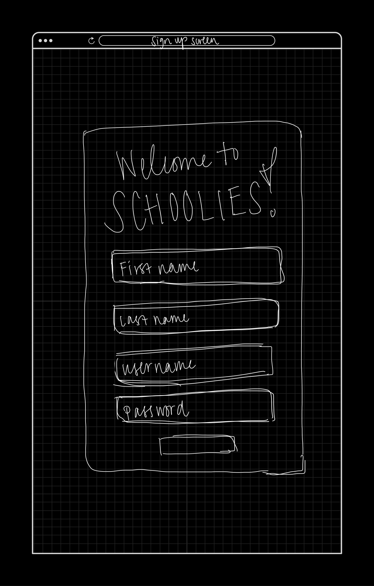
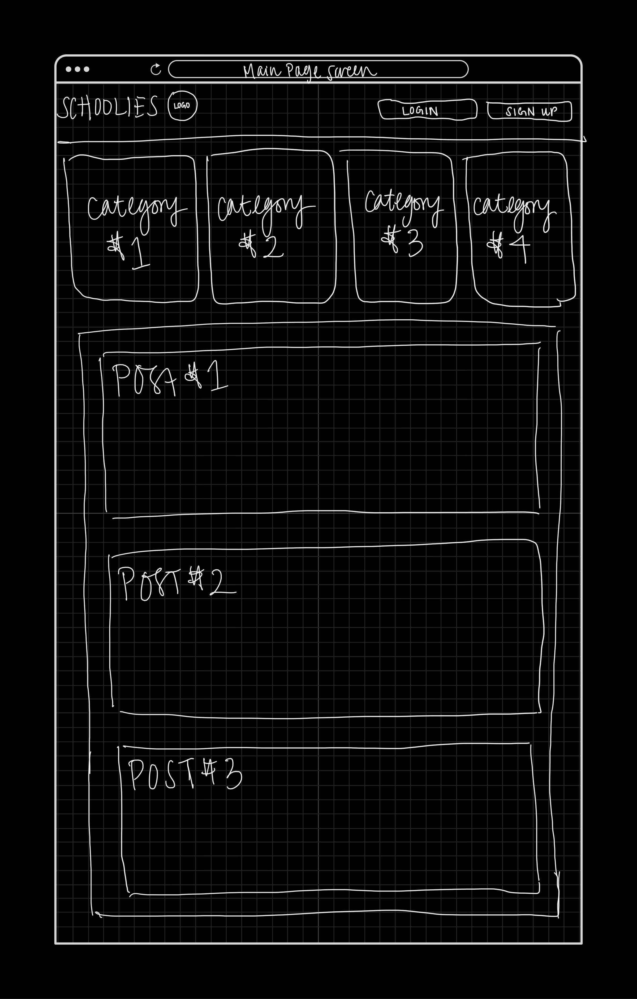
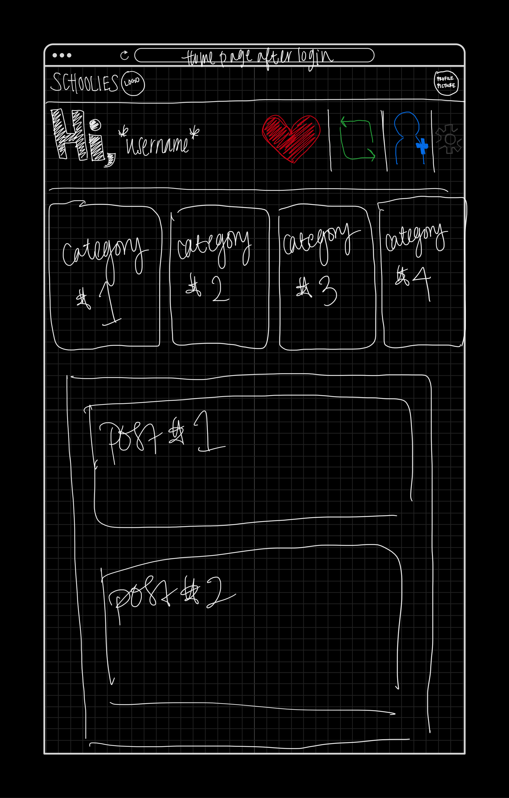
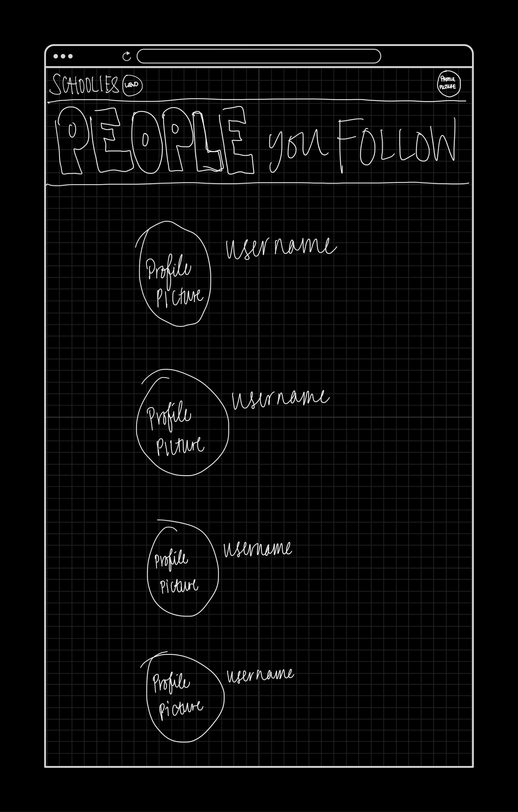
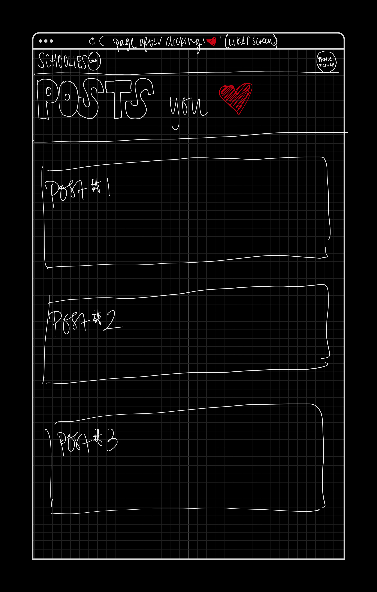
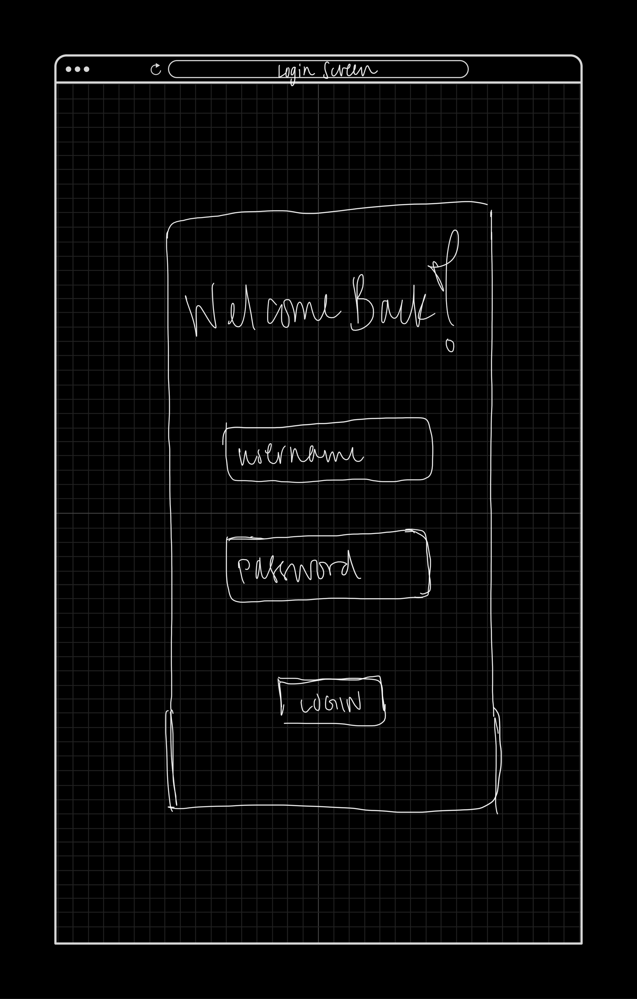
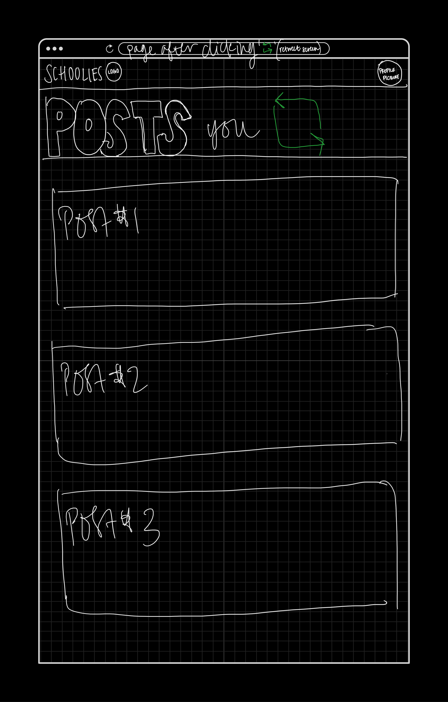
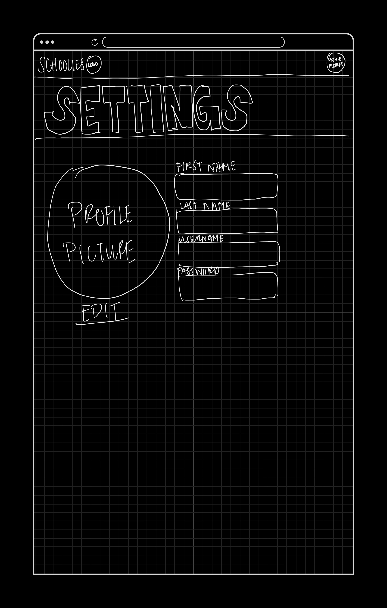

# Schoolies Web Forum

> The information below includes items from the project prompt
## Motivation
Use the agile process to research, develop, deploy, and present a full stack webstore.  This is intended to give students the experience of designing and deploying a website while researching and learning new information. In addition,it gives students an opportunity to develop proficiency with the technology of their choicewhich will hopefully instill a sense of pride and accomplishment... wait...

## Project Description
For this project teams of 3-4 students will design and implement a webstore using modern web frameworks. This will require the development of a Representational state transfer(REST) Application Programming Interface (API), a constant integration, constant development (CICD) pipeline, and a persistence layer. The website should be deployed to a Platform as a Service (PaaS) such as Herokuor Google App Engine. 

## Project Board
[Schoolies Web Forum Project Board](https://github.com/dignacio0815/SchooliesForum/projects/1)

## Running the App
- Install the necessary Node packages: `npm install`
- To run the app: `node app.js`
- To access the database: `docker run -p 8081:8080 -e ADMINER_DEFAULT_SERVER=mysql adminer`

## You will be graded on the following:

**Activities Required**
- [x] Research libraries/frameworks
    - JavaScript
        - [express.js:](https://expressjs.com/)(back end REST)
        - [Node](https://nodejs.org/)
        - [React](https://reactjs.org/)
        - [Vue.js](https://vuejs.org/)
- [ ] Research Database Technologies
    - MongoDB
    - MariaDB
    - MySQL
    - Postgres
    - SQLite
- [x] Develop a wireframe of a website
- [x] Develop users stories and rate them

***

**REST API**
- [ ] API must support the following
    - [ ] List all posts (feed page)
    - [ ] Add new posts
    - [ ] Remove posts
    - [ ] Update items / user profile
    - [ ] Search for posts
    - [ ] Create new user account
    - [ ] User Log in
    - [ ] User log out
    - [ ] Favorite posts
    - [ ] Follow other users / universities
    
***

**Web front end**
- [ ] Landing page
    - The page that shows what your store is about
- [ ] Create account page
    - We have all seen these. Ask for a usernameand password
    - Do not allow duplicate usernames
    - enforce simple password rules (minimum length >=6 characters, alphanumeric with at least one special character)
- [ ] Log in page
    - Standard username and password page
- [ ] User profile page
    - Show the username and relevant detail
    - Shows liked, reshared, posts followers, and followed users
***
**Persistence Layer**
- [ ] MariaDB
- [ ] MySQL
- [ ] Information to be stored in  the database:
    - User information
    - Post information

## Mockups

